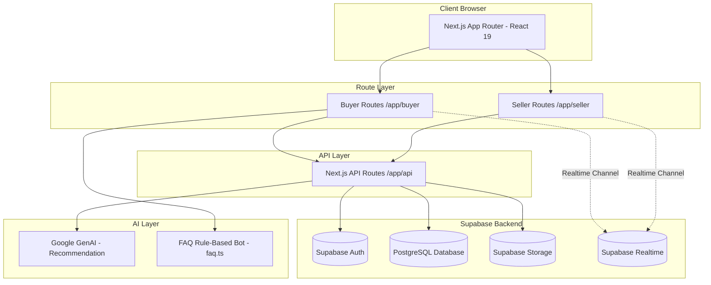
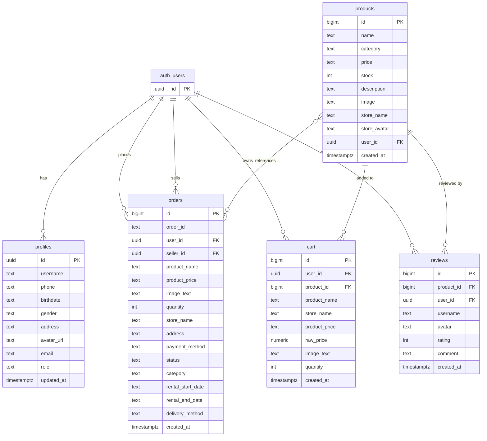

<div align="center">
  
  # FLEXA
  ### FLEXA adalah platform web e-commerce interaktif yang menyediakan dua sisi utama bagi penggunanya, yaitu sisi pembeli (buyer) untuk berbelanja dan sisi penjual (seller) untuk mengelola toko. Di dalam website ini terdapat berbagai kategori produk dan layanan yang ditawarkan, meliputi kategori elektronik, fashion, sewa, hingga jasa. 
  
  [](https://flexa-marketplace.vercel.app/)
  [](https://github.com/NarayanaMahendraAbimanyu/FLEXA-Marketplace)
  [](LICENSE)
 
  **Submission for ITECHNO CUP 2026 - Web Development**
  
  **By debugging bismillah**
  
</div>

---

## 📋 Daftar Isi

- [Tentang Proyek](#-tentang-proyek)
- [Fitur Unggulan](#-fitur-unggulan)
- [Demo & Screenshot](#-demo--screenshot)
- [Teknologi](#-teknologi)
- [Arsitektur Sistem](#-arsitektur-sistem)
- [Instalasi & Setup](#-instalasi--setup)
- [Penggunaan](#-penggunaan)
- [API Documentation](#-api-documentation)
- [Testing](#-testing)
- [Future Improvements](#-future-improvements)
- [Tim Pengembang](#-tim-pengembang)
- [Lisensi](#-lisensi)

---

## 👥 Tim Pengembang

| Nama | Peran | GitHub |
|------|-------|--------|
| **Narayana Mahendra Abimanyu** | Project Lead & Full Stack Developer | [GitHub](https://github.com/NarayanaMahendraAbimanyu) |
| **Muhammad Nawfal Rasikhuddin** | Frontend Developer | [GitHub](https://github.com/MuhammadNawfalRasikhuddin) |
| **Reza Putra Irawan** | UI/UX Designer | [GitHub](https://github.com/Rejaacoding) |

---

## 🎯 Tentang Proyek

### Latar Belakang

Perkembangan dunia e-commerce menuntut platform yang tidak hanya sekadar menjual produk fisik secara konvensional, tetapi juga mengakomodasi kebutuhan era digital yang dinamis — mulai dari kebutuhan sewa barang harian hingga transaksi jasa profesional. Seringkali, pengguna harus berpindah-pindah platform yang berbeda untuk membeli barang elektronik/fashion, menyewa barang, ataupun memesan jasa.

### Solusi yang Ditawarkan

**FLEXA** hadir sebagai solusi *all-in-one marketplace* interaktif yang merangkum berbagai kebutuhan dalam satu platform. Dengan memisahkan alur pengalaman pengguna menjadi **Sisi Pembeli (Buyer)** yang praktis dan **Sisi Penjual (Seller)** yang *powerful*, FLEXA memudahkan siapa saja untuk berbelanja, menyewa, menawarkan jasa, maupun mengelola toko online mereka sendiri dengan mudah.

### Tujuan Proyek

- 🎯 **Tujuan Utama**: Membangun ekosistem marketplace terintegrasi yang mendukung transaksi produk fisik (elektronik & fashion), sistem sewa (rental), serta pemesanan jasa.
- 📊 **Target Pengguna**: Masyarakat umum yang ingin berbelanja/menyewa/mencari jasa, serta UMKM/individu yang ingin memperluas jangkauan bisnis sebagai penjual (seller).
- 💡 **Value Proposition**: Fleksibilitas tinggi dalam satu platform dengan antarmuka yang modern, responsif, dan mudah digunakan.

---

## ✨ Fitur Unggulan

### Fitur Utama

| Fitur | Deskripsi | Keunggulan |
|-------|-----------|------------|
| **Multi-Role Experience (Buyer & Seller)** | Pengguna dapat bertindak sebagai pembeli untuk transaksi produk maupun beralih ke mode seller untuk manajemen toko. | Pengelolaan terpusat dalam satu akun tanpa perlu registrasi ulang. |
| **Diverse Categories (Produk, Sewa, & Jasa)** | Menyediakan direktori khusus untuk Elektronik, Fashion, Layanan Sewa Barang, hingga Penawaran Jasa. | Menjawab berbagai macam kebutuhan pengguna dalam satu aplikasi (*all-in-one*). |
| **Interactive Catalog & Search** | Sistem pencarian, filter kategori, dan detail produk yang interaktif serta responsif. | Mempermudah pengguna menemukan barang atau jasa impian dengan cepat. |
| **Seller Dashboard** | Panel kontrol bagi penjual untuk menambah produk/layanan, memantau pesanan, dan mengatur toko. | Membantu UMKM mendigitalkan bisnis mereka secara mandiri. |

### Fitur Tambahan

- **Responsive Layout** — Tampilan optimal di berbagai perangkat (Mobile, Tablet, Desktop).
- **Interactive UI Components** — Desain modern menggunakan komponen visual yang interaktif.
- **Fast Deployment** — Terintegrasi secara langsung dengan platform cloud Vercel untuk akses cepat.

---

## 📸 Demo & Screenshot

### Live Demo

🔗 **[Kunjungi Website](https://flexa-marketplace.vercel.app/)**

### Screenshot Aplikasi

<div align="center">
  
  <p><em>Homepage - Tampilan utama aplikasi</em></p>

  
  <p><em>Dashboard - Panel kontrol pengguna</em></p>

  
  <p><em>[Nama Fitur] - [Deskripsi screenshot]</em></p>
</div>

---

## 🛠️ Teknologi

### Tech Stack

**Frontend**
- Framework: Next.js (React Framework, App Router)
- Language: TypeScript
- UI Library: Tailwind CSS / CSS3
- State Management: React Hooks / Context API

**Backend**
- BaaS: Supabase (Backend as a Service)
- Database: PostgreSQL (via Supabase)
- Auth: Supabase Auth (Email & Password / OAuth)
- Storage: Supabase Storage (Product & Avatar Buckets)

**DevOps & Tools**
- Deployment: Vercel
- CI/CD: Vercel Git Integration
- Version Control: Git & GitHub

### Alasan Pemilihan Teknologi

| Teknologi | Alasan Pemilihan |
|-----------|-------------------|
| **Next.js & TypeScript** | Memberikan performa optimal dengan fitur SSR/SSG serta keamanan tipe data yang ketat untuk mencegah bug di sisi frontend. |
| **Supabase** | Menyediakan database PostgreSQL yang andal, sistem autentikasi instan, serta manajemen file storage yang terintegrasi dengan sangat baik untuk kebutuhan marketplace. |
| **Tailwind CSS** | Mempercepat proses styling dengan utility-class yang responsif dan konsisten untuk tampilan multi-device. |

### Dependencies Utama

```json
{
  "dependencies": {
    "@google/genai": "^2.21.0",
    "@supabase/supabase-js": "^2.112.4",
    "lucide-react": "^1.41.0",
    "next": "16.3.2",
    "react": "19.2.8",
    "react-dom": "19.2.8"
  }
}
```

**Penjelasan Dependencies:**

| Package | Kegunaan |
|---|---|
| `next` | Framework utama — routing (App Router), server-side rendering, API routes |
| `react` & `react-dom` | Library inti untuk membangun antarmuka pengguna berbasis komponen |
| `@supabase/supabase-js` | SDK resmi untuk koneksi ke Supabase — autentikasi, database, storage, dan realtime subscription |
| `@google/genai` | SDK untuk mengakses Google Gemini AI — digunakan pada fitur rekomendasi produk (`Recommendation.tsx`) |
| `lucide-react` | Kumpulan ikon SVG ringan yang dipakai di seluruh antarmuka (ikon chat, cart, navigasi, dll) |

---

## 🏗️ Arsitektur Sistem

### System Architecture

FLEXA dibangun dengan arsitektur **Serverless Full-Stack** menggunakan Next.js App Router sebagai satu kesatuan frontend & backend (API Routes), yang di-deploy di Vercel. Seluruh backend logic — autentikasi, database, storage, dan realtime messaging — ditangani oleh Supabase sebagai Backend-as-a-Service (BaaS).

Aplikasi dipisah menjadi dua alur pengalaman berbasis role:

- **Buyer Flow** (`app/buyer/`) — cart, profile, purchase, checkout, chat, dengan komponen seperti Hero, LoginModal, Recommendation, RentalDatePicker, dan ServiceBookingCard.
- **Seller Flow** (`app/seller/`) — dashboard, income, orders, product management, store settings, dan chat khusus seller.

Berbeda dengan marketplace pada umumnya, FLEXA menerapkan **strict role separation**: satu akun hanya bisa terikat pada satu peran (buyer atau seller). Untuk berpindah peran, pengguna wajib logout dan login dengan akun yang berbeda — mencegah konflik data transaksi antara peran pembeli dan penjual.

### Component Diagram



### Database Schema (Supabase - schema public)

#### ERD (Entity Relationship)



#### Detail Tabel

| Tabel | Kolom Kunci | Kegunaan | RLS |
|---|---|---|---|
| **profiles** | `id (PK, FK→auth.users)`, `role`, `username`, `email`, `phone`, `address`, `avatar_url` | Data profil pengguna; `role` bernilai `"pembeli"` atau `"penjual"` untuk membedakan sisi buyer/seller | ✅ Enabled |
| **products** | `id (PK)`, `name`, `category`, `price`, `stock`, `store_name`, `user_id (FK→auth.users)` | Listing produk/sewa/jasa milik seller, dibedakan lewat `category`; `user_id` menandai pemilik toko | ✅ Enabled |
| **cart** | `id (PK)`, `user_id (FK)`, `product_id (FK→products)`, `raw_price`, `quantity` | Keranjang belanja; simpan salinan data produk (denormalized) agar tampil cepat tanpa join | ✅ Enabled |
| **orders** | `id (PK)`, `order_id`, `user_id (FK)`, `seller_id (FK)`, `status`, `category`, `rental_start_date`, `rental_end_date`, `delivery_method`, `payment_method` | Transaksi final — satu tabel menangani pembelian, sewa, dan jasa. `seller_id` memungkinkan seller mengelola order untuk produknya sendiri | ✅ Enabled |
| **conversations** | `buyer_id`, `seller_id`, `product_id` | Metadata percakapan chat antara buyer & seller | Public schema |
| **messages** | `id (PK)`, `product_id`, `sender`, `created_at` | Isi pesan chat, Realtime aktif | Realtime: Enabled |
| **reviews** | `id (PK)`, `product_id (FK)`, `user_id (FK)`, `username`, `rating`, `comment` | Ulasan buyer terhadap produk; `user_id` memastikan hanya pemilik ulasan yang dapat mengubah/menghapusnya | ✅ Enabled |
| **store_settings** | `user_id (FK)`, `store_name`, `store_address`, `logo_url` | Pengaturan toko milik seller | Public schema |

> ✅ **Keamanan Data**: Row Level Security (RLS) telah diaktifkan pada tabel-tabel utama (`profiles`, `products`, `cart`, `orders`, `reviews`) dengan policy yang memastikan setiap pengguna hanya dapat mengakses dan mengubah data miliknya sendiri.
>
> ✅ **Route Protection**: Halaman di bawah `/buyer/*` dan `/seller/*` dilindungi pengecekan sesi login dan `role` pengguna di level layout (`app/buyer/layout.tsx` dan `app/seller/layout.tsx`). Pengguna yang belum login otomatis diarahkan ke halaman login, dan pengguna dengan `role` yang tidak sesuai diarahkan kembali ke halaman utama.
>
> 💡 **Catatan teknis**: Kolom harga (`price` di `products`, `product_price` di `orders`/`cart`) disimpan sebagai `text` untuk keperluan tampilan (format "Rp X.XXX.XXX"), sementara `cart.raw_price` disimpan sebagai `numeric` untuk kebutuhan kalkulasi seperti subtotal keranjang.

### Alur Fitur Utama

| Fitur | Alur Singkat |
|---|---|
| **Login/Register** | `LoginModal.tsx` → Supabase Auth → trigger buat baris di `profiles` → redirect sesuai `role` (`pembeli`/`penjual`) |
| **Role Separation** | `role` di `profiles` bersifat permanen per akun; pindah peran = logout & login akun lain. Diperkuat dengan route guard di `layout.tsx` masing-masing sisi |
| **Katalog Produk/Sewa/Jasa** | Semua listing di tabel `products`, difilter lewat kolom `category` (Elektronik, Fashion, Sewa, Jasa) |
| **Tambah ke Keranjang** | `cart` menyimpan salinan data dari `products`; dilindungi RLS agar hanya pemilik keranjang yang dapat mengakses |
| **Checkout & Transaksi** | Data dari produk/keranjang → generate `order_id` unik → insert ke `orders` dengan `seller_id` merujuk pemilik produk, `status` default `"Belum dikirim"` |
| **Sewa Barang** | `RentalDatePicker.tsx` mengisi `rental_start_date` & `rental_end_date`; tanggal yang sudah lewat divalidasi agar tidak dapat dipilih (via atribut `min` dan validasi `onBlur`) |
| **Booking Jasa** | `ServiceBookingCard.tsx` mengisi jadwal booking dengan validasi tanggal serupa, lalu mengirim permintaan konfirmasi lewat chat |
| **Realtime Chat** | `ChatWidget.tsx` ↔ `seller/chat` — subscribe tabel `messages` via Supabase Realtime |
| **FAQ Auto-Reply** | `findFaqAnswer()` di `lib/faq.ts` cek keyword sebelum pesan diteruskan ke seller |
| **Beri Ulasan** | Buyer wajib login untuk mengirim ulasan; `user_id` tersimpan untuk memastikan hanya pemilik ulasan yang dapat mengubahnya |
| **Rekomendasi Produk** | `Recommendation.tsx` → API route → Google GenAI (`@google/genai`) |

### Folder Structure

```
FLEXA-Marketplace/
├── app/
│   ├── api/
│   ├── buyer/
│   │   ├── cart/
│   │   ├── profile/
│   │   ├── purchase/
│   │   ├── chat/
│   │   ├── checkout/
│   │   ├── components/sections/
│   │   │   ├── Hero.tsx
│   │   │   ├── LoginModal.tsx
│   │   │   ├── Recommendation.tsx
│   │   │   ├── RentalDatePicker.tsx
│   │   │   └── ServiceBookingCard.tsx
│   │   ├── BuyerSideBar.tsx
│   │   ├── ChatWidget.tsx
│   │   ├── ChatWrapper.tsx
│   │   ├── NavbarBuyer.tsx
│   │   ├── NavbarGuest.tsx
│   │   └── layout.tsx
│   ├── seller/
│   │   ├── chat/
│   │   ├── dashboard/
│   │   ├── income/
│   │   ├── orders/
│   │   ├── product/
│   │   ├── storeSettings/
│   │   └── layout.tsx
│   ├── data/
│   ├── login/
│   ├── signin/
│   ├── lupa-password/
│   ├── reset-password/
│   ├── product/
│   ├── store/
│   ├── globals.css
│   ├── layout.tsx
│   ├── not-found.tsx
│   └── page.tsx
├── lib/
│   ├── faq.ts
│   └── supabaseClient.ts
└── public/
    ├── flexa-logo-green.png
    └── flexa-logo-white.png
```

---

## ⚙️ Instalasi & Setup

### Prerequisites

Pastikan sudah terinstall:
- **Node.js** v18.x atau lebih tinggi
- **npm** (bawaan Node.js)
- **Git**
- Akun **Supabase** (untuk database, auth, storage, realtime)
- **Google AI Studio API Key** (untuk fitur rekomendasi produk via `@google/genai`)

### Langkah Instalasi

#### 1️⃣ Clone Repository

```bash
git clone https://github.com/NarayanaMahendraAbimanyu/FLEXA-Marketplace.git
cd FLEXA-Marketplace
```

#### 2️⃣ Install Dependencies

```bash
npm install
```

Perintah ini akan menginstall seluruh package yang tercantum di `package.json`, termasuk `next`, `react`, `@supabase/supabase-js`, `@google/genai`, dan `lucide-react` seperti yang tercantum di bagian [Dependencies Utama](#dependencies-utama) di atas.

#### 3️⃣ Setup Environment Variables

Buat file `.env.local` di root project (sejajar dengan `package.json`):

```env
NEXT_PUBLIC_SUPABASE_URL="https://xxxxx.supabase.co"
NEXT_PUBLIC_SUPABASE_ANON_KEY="your_supabase_anon_key"

GOOGLE_GENAI_API_KEY="your_google_genai_api_key"
```

> ⚠️ **Penting**: Nilai di atas hanyalah contoh format. Jangan pernah menaruh API key asli di file yang di-commit ke GitHub. Pastikan `.env.local` sudah masuk `.gitignore`.

`NEXT_PUBLIC_SUPABASE_URL` dan `NEXT_PUBLIC_SUPABASE_ANON_KEY` diambil dari Supabase Dashboard → Project Settings → API.

`GOOGLE_GENAI_API_KEY` diambil dari [Google AI Studio](https://aistudio.google.com/).

#### 4️⃣ Setup Database di Supabase

Jalankan SQL berikut di **Supabase Dashboard → SQL Editor** untuk membuat seluruh tabel sesuai skema di bagian [Database Schema](#database-schema-supabase---schema-public), dengan urutan:

1. `profiles` (bergantung pada `auth.users`)
2. `products`
3. `cart` (bergantung pada `products` & `auth.users`)
4. `orders`
5. `conversations`, `messages` (aktifkan Realtime), `store_settings`, `reviews`

Setelah semua tabel dibuat, aktifkan **Row Level Security (RLS)** beserta policy masing-masing tabel sesuai kebutuhan akses (lihat catatan keamanan di bagian Database Schema).

#### 5️⃣ Run Development Server

```bash
npm run dev
```

Aplikasi berjalan di `http://localhost:3000`

---

## 🚀 Penggunaan

### Menjalankan Aplikasi

```bash
npm run dev      # Development server
npm run build    # Build production
npm run start    # Jalankan hasil build
npm run lint     # Cek linting
```

### User Guide

#### Untuk Buyer

1. **Registrasi/Login** — Klik tombol login di navbar, isi form di `LoginModal.tsx`. Akun baru otomatis mendapat baris di tabel `profiles` dengan `role = "pembeli"`.
2. **Cari & Filter Produk** — Gunakan pencarian dan filter kategori (Elektronik, Fashion, Sewa, Jasa) di halaman utama.
3. **Sewa Barang** — Pilih produk kategori Sewa, tentukan tanggal mulai & selesai lewat `RentalDatePicker.tsx`, lalu checkout.
4. **Booking Jasa** — Pilih produk kategori Jasa, isi detail lewat `ServiceBookingCard.tsx`, lalu checkout.
5. **Chat dengan Seller** — Klik ikon chat pada produk untuk membuka `ChatWidget.tsx`; jika pertanyaan cocok dengan FAQ (`lib/faq.ts`), jawaban muncul otomatis, jika tidak akan diteruskan ke seller secara realtime.
6. **Checkout & Riwayat** — Kelola keranjang di `/buyer/cart`, lihat riwayat transaksi di `/buyer/purchase`.

#### Untuk Seller

1. **Registrasi sebagai Seller** — Daftar dengan akun baru; `role` di `profiles` diset `"penjual"`. Akun yang sama tidak bisa dipakai untuk mode buyer.
2. **Kelola Produk** — Tambah/edit/hapus listing di `/seller/product`, tentukan `category` sesuai jenis (Elektronik, Fashion, Sewa, Jasa).
3. **Pantau Pesanan** — Lihat dan update status order di `/seller/orders`.
4. **Cek Pendapatan** — Ringkasan penjualan tersedia di `/seller/income`.
5. **Balas Chat Buyer** — Kelola percakapan realtime di `/seller/chat`.
6. **Atur Toko** — Ubah nama toko, avatar, dan info lain di `/seller/storeSettings`.

---

## 📚 API Documentation

### Base URL

```
Development: http://localhost:3000/api
Production:  https://flexa-marketplace.vercel.app/api
```

### Endpoints

> 📍 Setiap endpoint berikut berada di file `app/api/[nama-folder]/route.ts`. Sesuaikan nama folder dengan struktur route API yang sudah ada di project kamu.

#### Produk

```http
GET    /api/products              # Ambil semua produk, bisa difilter ?category=
GET    /api/products/:id          # Detail satu produk
POST   /api/products              # Tambah produk baru (seller only)
PUT    /api/products/:id          # Update produk (seller only, milik sendiri)
DELETE /api/products/:id          # Hapus produk (seller only, milik sendiri)
```

#### Keranjang & Order

```http
GET    /api/cart                  # Ambil isi keranjang user yang login
POST   /api/cart                  # Tambah item ke keranjang
DELETE /api/cart/:id              # Hapus item dari keranjang

POST   /api/orders                # Buat order baru dari checkout
GET    /api/orders                # Ambil riwayat order user
PUT    /api/orders/:id/status     # Update status order (seller only)
```

#### Chat

```http
GET    /api/conversations         # Ambil daftar percakapan user
POST   /api/messages              # Kirim pesan baru (tersimpan ke tabel messages, otomatis broadcast via Realtime)
```

#### Rekomendasi (AI)

```http
POST   /api/recommendation        # Kirim preferensi/histori user, dapatkan rekomendasi produk dari Google GenAI
```

### Contoh Request

```javascript
const response = await fetch('/api/recommendation', {
  method: 'POST',
  headers: { 'Content-Type': 'application/json' },
  body: JSON.stringify({
    userId: 'uuid-user',
    category: 'Elektronik'
  })
});

const data = await response.json();
```

---

## 🧪 Testing

Saat ini FLEXA belum memiliki automated test suite (unit/integration/e2e). Pengujian dilakukan secara manual selama pengembangan, mencakup:

- Alur registrasi & login untuk role buyer dan seller
- Alur tambah ke keranjang → checkout → order tercatat di database
- Alur sewa barang dengan validasi tanggal mulai/selesai
- Realtime chat antara akun buyer dan seller secara bersamaan
- Fallback jawaban FAQ otomatis di chat
- Tampilan responsif di ukuran layar mobile, tablet, dan desktop

> 💡 **Future Improvement**: menambahkan automated testing (misal dengan Jest + React Testing Library untuk unit test, dan Playwright untuk E2E) agar regresi lebih mudah terdeteksi di iterasi berikutnya. Jika sempat sebelum deadline, menambahkan 1-2 unit test sederhana (misal untuk `findFaqAnswer()` di `lib/faq.ts`) bisa jadi nilai tambah kecil namun berarti untuk penilaian juri.

---

## 🔮 Future Improvements

- Konversi kolom harga (`price`, `product_price`) dari `text` ke tipe numerik agar mendukung sorting dan agregasi data secara langsung di database
- Menambahkan automated testing (unit, integration, e2e)
- Sistem notifikasi realtime untuk update status order
- Payment gateway terintegrasi (saat ini `payment_method` masih berupa input manual)
- Audit ulang seluruh RLS policy dan route protection secara berkala seiring penambahan fitur baru
- Implementasi middleware-level route protection sebagai lapisan tambahan di atas pengecekan client-side yang sudah ada

---

## 📄 Lisensi

Proyek ini dilisensikan di bawah [MIT License](LICENSE) - lihat file LICENSE untuk detail lebih lanjut.

---

<div align="center">

  **Made with ❤️ by debugging bismillah for ITECHNO CUP 2026**

</div>
